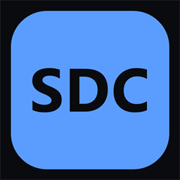

<div align="center">



<h1>SDC — Skilleddesk Code</h1>

<p><strong>Local-first coding-agent workbench.</strong></p>

<p>
  <sub><strong>PROPRIETARY SOFTWARE — ALL RIGHTS RESERVED. NOT OPEN SOURCE.</strong><br />
  Published for reading, review and security audit only; no licence to copy, modify or<br />
  redistribute is granted. See <a href="../LICENSE">LICENSE</a>.</sub>
</p>

</div>

---

This repository is a **monorepo**: a Tauri 2 desktop app, a host daemon written in Rust,
and the protocol definition that connects them.

> **Status — the app and the daemon both run, and they talk to each other.**
> The app is complete: topbar, sidebar, tabs, turn stream, prompt area, right panel, status bar,
> command palette, Provider Hub (six flows), Settings (seven tabs), Search, Add host, Permission,
> Time Machine, Duel and the F1 keymap reference — all folded from one append-only event log
> (spec §3.3). The daemon implements the whole plan of spec §10: SDCP over newline-delimited JSON,
> five engine adapters (`claude_code`, `codex`, `gemini`, `native_api`, `ollama`), the file guard,
> a shadow git repository, processes, the keychain, the ten environment checks, the provider
> backend, checkpoints, rewind, duel, the error translator, the Session Bridge and the console
> bridge. The Tauri bridge (`app/src-tauri/src/sdcp.rs`) is what carries SDCP into the window.
> What is still open is named, not hidden, in
> [What is deliberately absent](#what-is-deliberately-absent).

| Document | Role |
| --- | --- |
| `docs/MASTER_SPEC.md` | Master build specification v3.0. Locked stack (§4.1), UI law (§7–§9). Where it and the prototype disagree, the prototype wins (§7). |
| `SETUP.md` | Fresh-machine toolchain guide (Node, pnpm, Rust, Tauri CLI, platform dependencies). |
| `design/ui-prototype.html` | Working UI prototype — the UI source of truth. |
| `design/tokens.json` | Design tokens extracted from the prototype CSS. |
| `protocol/README.md` | What SDCP is, and the rules this directory will follow. |

## Layout

```
sdc/
├── app/                     Tauri 2 desktop app
│   ├── src/                 React 18 + TypeScript (strict) frontend
│   │   ├── layout/              the shell: region placeholders, Shell.css, viewport + keyboard hooks
│   │   ├── store/               Zustand stores — layout.ts is the first one
│   │   ├── styles/globals.css   design-token layer, Tailwind layers, base typography
│   │   ├── strings.ts           every user-visible string (spec §2.7)
│   │   └── App.tsx              composition root: #app, .workspace, the five regions
│   ├── src-tauri/           Rust shell (window, plugins, capabilities, bundling)
│   ├── package.json         @sdc/app — frontend scripts + Tauri CLI
│   ├── vite.config.ts       Tauri-driven dev server (port 1420)
│   ├── tailwind.config.ts   token aliases; no hardcoded colours (spec §8.1)
│   ├── postcss.config.js    Tailwind + autoprefixer
│   ├── tsconfig.json        strict type checking for src/
│   ├── tsconfig.node.json   strict type checking for the build tooling
│   ├── eslint.config.js     ESLint 9 flat config
│   └── index.html           Vite entry document
├── sdcd/                    Host daemon — a separate Rust binary (spec §3.1)
│   ├── src/main.rs
│   └── Cargo.toml
├── protocol/                SDCP schema (JSON Schema + generated TS types) — README only in STEP 1
├── design/                  tokens.json (authoritative), ui-prototype.html
├── docs/                    MASTER_SPEC.md
├── package.json             workspace root: scripts that fan out to app/ and sdcd/
├── pnpm-workspace.yaml      the workspace definition
└── README.md
```

## Toolchain

Everything needed is installed step by step in `SETUP.md`. Short version:

| Requirement | Version | Note |
| --- | --- | --- |
| Node.js | 20 LTS (target) | Newer versions work; the locked target is 20 LTS. |
| pnpm | 10.x | The workspace manager (see below). |
| Rust | stable, via rustup | Pinned by `rust-toolchain.toml`. `app/src-tauri` and `sdcd` are both cargo projects. |
| Tauri CLI | 2.x | Installed as a dev dependency of `app`, so `pnpm tauri:dev` needs no global install. |
| Windows only | MSVC Build Tools + WebView2 | Installed on this machine: VS 2022 Build Tools with MSVC 14.44.35207, Windows SDK 10.0.26100.0 and WebView2 153. Tauri cannot link a Windows build without them. |
| Linux only | `webkit2gtk-4.1`, `libayatana-appindicator3` etc. | See `SETUP.md` §6. |

## Why pnpm workspaces (and not a Makefile)

The master spec mentions `make gen` as the token generator, and STEP 1 had to choose between a
root `package.json` workspace and a Makefile. **pnpm workspaces won**, for four reasons:

1. The acceptance command is `pnpm --filter app …`, which only exists in a pnpm workspace.
2. pnpm is already the locked package manager, and `pnpm-workspace.yaml` gives one lockfile for
   every JavaScript package (today `app/`; `protocol/` joins it in STEP 2).
3. `make` is not part of the locked stack and is not present on a stock Windows machine, while
   `pnpm` is required on all three target platforms anyway.
4. Rust targets do not need `make`: `cargo` is already a task runner. The root scripts simply
   forward to it (`pnpm sdcd:run`, `pnpm rust:clippy`).

The token generator that the spec calls `make gen` therefore becomes a pnpm script
(`pnpm tokens:gen`) in STEP 2, with the same contract: `design/tokens.json` →
`tokens.css` + Tailwind theme. Nothing else changes.

## Commands

Run these from the repository root unless noted. `pnpm --filter app …` and
`pnpm --filter @sdc/app …` are equivalent (`app` is the package directory, `@sdc/app` its name).

| Command | What it does |
| --- | --- |
| `pnpm install` | Install all workspace dependencies. |
| `pnpm dev` | Vite dev server on <http://localhost:1420> (browser only — no Tauri window). |
| `pnpm build` | Type check + production frontend bundle into `app/dist`. |
| `pnpm tauri:dev` | **Opens the desktop window** (Tauri dev: Vite server + Rust shell). |
| `pnpm tauri:build` | Release build + installers for the current platform. |
| `pnpm typecheck` | Strict TypeScript check of `src/` and of the build tooling. |
| `pnpm lint` | ESLint over the frontend. |
| `pnpm sdcd:run` | Build and run the host daemon (`cargo run` in `sdcd/`) — serves SDCP on `127.0.0.1:7811`. |
| `pnpm test` | Vitest over the frontend: the reducer, the command registry, the store-selector rule (23 tests). |
| `pnpm --filter @sdc/app smoke` | **Opens the built `dist` in a real browser** and fails unless the app mounted, the shell is in the page, there is text to read and nothing threw. No dependencies, no CDP; `skipped` on a machine with no Chromium-family browser, required in CI. |
| `pnpm sdcd:test` | `cargo test` in `sdcd/`: 100 tests — 92 unit, 3 daemon-lifecycle (real binary: `host.shutdown`, `--idle-exit`, hand-started stays) and 5 VCR. |
| `pnpm daemon:package` | Build `sdcd` in release and stage it as the sidecar the installer bundles. |
| `pnpm rust:fmt` / `pnpm rust:clippy` | Format / lint the daemon crate. |

Inside `app/`: `pnpm tauri dev`, `pnpm tauri build`, `pnpm tauri icon <png>` also work directly.
Inside `sdcd/`: plain `cargo run`, `cargo test`. Inside `app/src-tauri/`: `cargo check` type checks the
bridge without building the window.

## Run it

Two ways, and they differ only in who answers SDCP.

**1. Browser (fastest, no Rust build).** `pnpm dev` opens <http://localhost:1420>. `lib/sdcp.ts`
finds no Tauri bridge and no `VITE_SDCP_URL`, so it starts the in-process daemon
(`app/src/lib/daemon.ts`), which answers the *same* envelopes over `LoopbackTransport`. Every flow —
the six Provider Hub flows, Settings, Search, Palette, Time Machine, Duel — is live, because the
fallback is a daemon and not a mock: it appends to the same event log the reducer folds.

**2. Desktop (`pnpm tauri:dev`).** The window loads, `TauriTransport` is chosen, and the first
`sdcpCall` runs `sdcp_call` in `app/src-tauri/src/sdcp.rs`, which connects to `127.0.0.1:7811` —
starting `sdcd` first if it is not already running (it looks next to the app binary, then in
`sdcd/target/{release,debug}`). Everything the daemon pushes comes back as the `sdcp://event` Tauri
event, so a turn's `TurnDelta` stream reaches the store after `engine.start` has already answered.

**Who owns the daemon.** The app does, for the daemon it started: it spawns `sdcd` with
`CREATE_NO_WINDOW` (a console program would otherwise be given a console window next to the app), it
kills that child when the window closes, and it passes `--idle-exit 8` so a daemon whose app was killed
rather than closed still leaves. A daemon started by hand — `pnpm sdcd:run`, or a terminal you are
watching — has no such flag, is never killed, and never leaves on its own.

Two consequences worth knowing:

* **An older daemon on the port is replaced, not used.** `host.status` reports the daemon's `sdcd`
  version; when it is not this build's, the bridge sends `host.shutdown` (a real method, additive to
  SDCP 0.1), waits for the port and starts the `sdcd` this build ships. Installing an update over a
  running daemon therefore just works; the alternative was every method answering `unknown method`.
* **`sdcp_status` tells you what is connected**: `appVersion`, `daemonVersion`, `restarted`,
  `spawned`, `lastSeq`.

**Which engine answers.** `engine.start` looks the engine up in `EngineRegistry`:
`claude_code` (`claude --include-partial-messages`), `codex`, `gemini`, `native_api` (an `http://`
endpoint streams today; a remote `https://` one reports that a TLS client is not linked in this
build) and `ollama` (real NDJSON against `127.0.0.1:11434`). A CLI that is not installed produces a
`ErrorRaised` that says so, with the doctor's `Install` row behind it — which is what the translator
rule `missing-program` exists for.

## Acceptance (STEP 1)

| Criterion | Command | State |
| --- | --- | --- |
| Window shows "Hello SDC" | `pnpm --filter app tauri:dev` | **Verified** — window titled `SDC`, client area 1280×800 (measured 1296×839 including native decorations), showing "Hello SDC" with the Lucide terminal icon and the mono tagline on the `--bg-base` / `--bg-raised` tokens. 389 crates compiled in 1m46s. |
| Daemon smoke line | `cargo run` inside `sdcd/` | **Verified** on the default MSVC toolchain — exits 0 and prints `sdcd ok`. (Also verified earlier with the gnu toolchain, before MSVC existed.) |
| Strict TypeScript passes | `pnpm --filter app typecheck` | Verified — exits 0. Also verified: `pnpm --filter app lint` and `pnpm --filter app build`. |
| Windows installer builds | `pnpm --filter app tauri:build` | **Verified** — `target/release/sdc.exe` (8.81 MB) and `bundle/msi/SDC_0.0.1_x64_en-US.msi` (4.26 MB), with WiX reporting `Finished 1 bundle`. Installer metadata read back: `ProductName = SDC`, `ProductVersion = 0.0.1`, `Manufacturer = skilleddesk`, `ARPPRODUCTICON = ProductIcon`. |
| No feature code | — | Verified by inspection; see below. |

## Build configuration decisions

**Window (spec §7.2, task 3).** `src-tauri/tauri.conf.json` sets `title: "SDC"`, 1280×800,
minimum 900×600, resizable, `decorations: true`, `transparent: false`, centred. The window label
is `main`, which is what the capability file targets and what the frontend API refers to.

**Identifier and bundles (task 4).** Bundle identifier `dev.skilleddesk.sdc`; bundle targets
`["msi", "dmg", "appimage", "deb"]`. Because no host can build another platform's installer,
each platform narrows the list through Tauri's platform config files:

| File | Effective targets |
| --- | --- |
| `tauri.conf.json` (base) | `msi`, `dmg`, `appimage`, `deb` — the full cross-platform intent |
| `tauri.windows.conf.json` | `msi` |
| `tauri.macos.conf.json` | `dmg` |
| `tauri.linux.conf.json` | `appimage`, `deb` |

These files are merged over the base config automatically, so `pnpm tauri:build` works on every
host without passing `--bundles` by hand.

**Capabilities (task 4, minimal).** `src-tauri/capabilities/default.json` grants exactly three
permission sets to the `main` window: `core:default` (Tauri's own safe defaults), `shell:default`
(open `http(s)://`, `tel:`, `mailto:` links with a pre-configured scope) and `dialog:default`
(message/open/save dialogs). The `fs` plugin is **not** installed and **not** granted —
filesystem access arrives with explicit, reviewed scopes, never as a blanket allow. Registering
a plugin in Rust grants nothing on its own; the capability file is the only grant.

**CSP.** `app.security.csp` is `null` in STEP 1 (the Tauri template default) so that HMR is not
fighting a policy while there is no remote content to protect. Tightening it is a release
blocker and belongs with the fs scopes.

**Icons.** `src-tauri/icons/` holds a generated placeholder set (background `--bg-base`, accent
tile `--accent`, "SDC" wordmark): `32x32.png`, `128x128.png`, `128x128@2x.png`, `icon.png`
(512, for Linux bundles), `icon.ico` (16–256, BMP entries) and `icon.icns`. Every artefact was
generated from one 1024 px master and read back to confirm it loads. Replace the whole set with
`pnpm --filter app tauri icon design/icon.png` once a real logo exists.

**TypeScript strictness.** `strict: true` plus `noUnusedLocals`, `noUnusedParameters`,
`noFallthroughCasesInSwitch`, `noImplicitOverride`, `noImplicitReturns`,
`verbatimModuleSyntax`, `isolatedModules` and `forceConsistentCasingInFileNames`. Build tooling
(`vite.config.ts`, `tailwind.config.ts`) is type checked separately in `tsconfig.node.json` with
Node types instead of DOM types. `exactOptionalPropertyTypes` and `noUncheckedIndexedAccess` are
deliberately off in STEP 1 — cheap to add per-module later, expensive to retrofit by surprise.

**Tailwind 3, pinned.** The locked stack requires `tailwind.config.ts`; Tailwind 4 is CSS-first
and has no config file, so `tailwindcss ^3.4` is pinned. Components take colour from token
aliases whose values are CSS custom properties, declared in `src/styles/tokens.css` (spec
§8.1–§8.4, mirrored 1:1 from `design/tokens.json`) and imported first by `globals.css`. The token
namespace is part of the class name, so a class spells both the property and the role:
`bg-bg-raised`, `text-text-primary`, `border-border-subtle`, `text-state-error`, `bg-diff-addBg`.
The generator (`pnpm tokens:gen`) is still to be written; until then the two token files are kept
identical by hand and must change together.

**Tauri CLI.** The CLI is a dev dependency of `app/` (`@tauri-apps/cli`), so `pnpm tauri:dev`
works without a global install. `cargo tauri` (the route `SETUP.md` describes) also works if the
binary is on `PATH`; both read the same `tauri.conf.json`.

**Release profile.** `app/src-tauri/Cargo.toml` builds releases with `lto`, `codegen-units = 1`,
`opt-level = "s"` and `strip`. If release build time becomes a problem, relax `lto` first.

## What is deliberately absent

Nothing here is a stub that pretends: each gap below is a boundary the code states at the point where
it is reached.

* **SDC drives an agent; it is not (yet) one itself.** This is the honest answer to "does it do what
  Cline does — give it a prompt and the project is finished?".

  What exists today: the daemon runs the *real* coding agents (`claude`, `codex`, `gemini`) and
  streams their structured output, gates a mutating action behind the Permission dialog, writes a
  checkpoint before it runs, restores files and conversation on a rewind, and can now **execute a
  command itself** (`shell.run`: captured output, exit code, translated failure, deny list, timeout).
  So an agent loop's four verbs — read, write, run, observe — are all in the daemon.

  What is missing is the **loop itself**: planning, choosing a tool, feeding the result back to a
  model and continuing until the task is done, without an external CLI in the middle. Today that loop
  lives inside Claude Code's CLI; SDC is the workbench around it. Building it in `sdcd` means a tool
  registry, a turn planner, the permission gate wired to execution rather than to a modal, and a
  budget/token accountant — the pieces are named in `NOTES.md` and each one is a step of its own.
  Until then, "prompt → finished project" works exactly as far as the CLI you connect can take it.

* **The sign-in recipes are one table, and they are not exercised against the real CLIs here.** SDC
  drives `claude` / `codex` / `gemini`'s own login (`auth::cli_login::RECIPES`) and proves the
  mechanism against a stand-in CLI that behaves the same way (prints a URL, waits for a line,
  announces success). None of the three is installed on the machine this was built on, so a CLI that
  changes its command or its success line needs that table corrected - which is why the UI shows the
  CLI's raw output instead of only "failed". SDC never sees the credential either way: the CLI writes
  it to its own store.
* **A model list can be `bundled` rather than `live`.** `models.list` asks each provider's own
  endpoint, caches the answer, and falls back to `protocol/models.json`; the row says which of the
  three it is. A remote provider is `https://`, which this build cannot reach without a TLS client, so
  until that lands a remote list is `bundled` (or `cached`) and says so. Ollama, being local `http://`,
  is listed live.
* **A TLS client for the native API.** `native_api` builds an Anthropic `messages` request or an
  OpenAI `chat/completions` request and parses both SSE dialects, and it streams today against an
  `http://` endpoint (LM Studio, vLLM, llama.cpp). A remote `https://` endpoint answers
  `a TLS client is not linked in this build; only http:// endpoints stream today` rather than
  pretending the turn started. The `https` transport is the next crate to add (`rustls` + `hyper`).
* **The provider OAuth token exchange.** `provider.oauth.open` returns a real URL and a real `state`;
  `provider.oauth.callback` records the state and says the exchange lands with the OAuth step. No
  token is invented, because a fake token would fail later in a stranger place.
* **Checkpoint screenshots.** `checkpoints::screenshot` owns the path and the contract; the pixels
  come from the app's WebView (`checkpoints::screenshot::record`), so a thumbnail appears when the
  preview writes one. The rewind does not depend on it: files are restored from the shadow
  repository, which is real today.
* **The OS keychain is behind a feature that is off by default.** `keychain` compiles
  (`cargo check --features keychain`, `keyring` v3) and would put a key in DPAPI / Keychain / Secret
  Service, but a headless box or a CI container has no such store, so the default is the documented
  file fallback under `<data>/keys/` (0600 on unix; Windows has no ACL applied yet). Turning the
  feature on for desktop builds is on the next-step list, and `host.status` reports which store was
  used either way.
* **`provider.test` distinguishes "accepted" from "verified".** A key's shape is checked locally and
  the answer carries `verified: false` plus a `detail` that says the provider was not contacted,
  because this build cannot reach an `https://` endpoint. Only the local Ollama daemon (and an
  `http://` endpoint) is really probed, and that answers `verified: true`. The browser's in-process
  daemon asserts the happy path (`verified: true`) on purpose: it *is* the provider's stand-in.
* **Installers for macOS and Linux, and a signed build.** CI publishes all of them (`*.dmg` ×2,
  `*.AppImage`, `*.deb`, `*.msi`, `*_x64-setup.exe`); on Windows the **installed** app was verified end
  to end in 0.4.4 — silent install, the window renders, the daemon it started is 0.4.4, no console
  window, and both the app and its daemon are gone after quitting. macOS and Linux artifacts are built
  and published but have not been opened on their own hosts from here, and signing needs certificates
  this repository does not hold.
* **An axe-core pass and a screen-reader sweep.** The accessibility work is in the markup (roles,
  `aria-current`, focus traps, `Escape` handling, the keymap reference), but the automated audit has
  not been run in CI yet.
* **`protocol/` is not an npm package yet.** `types.ts` is real and imported by the app; it joins the
  workspace when a generator (schema → types) exists, so the two cannot drift.
* **Federated/remote hosts beyond one SSH target.** `host.add` records an SSH host, says out loud
  whether this machine can `ssh` to it, and `host.remove` takes it back off the list along with its
  chats; the app's switcher works. A second daemon on the far side of a tunnel is reached with
  `VITE_SDCP_URL` and is not yet provisioned by the app, so an added host is a *record* of a machine
  rather than a second `sdcd` to talk to.
* **A file tree / project browser in the sidebar.** Since 0.7.6 a chat *has* a working directory: `project.add`
  / `project.list` / `project.remove` exist, `session.open` takes a `projectId`, `session.list` reports
  `projectId` + `projectRoot` per chat, `session.update` can re-point a chat, the engines are started **in**
  that folder, and the prompt toolbar shows it (`Working in SDC`, full path in the tooltip). What is still
  absent is everything that *browses* a project: **no file tree**, no folder rows in the sidebar, no way to
  open a file from the window, and `fs.list` still has no caller in `app/src` (the folder chooser is the native
  dialog, not `fs.list`-driven). Opening a file into a reader/editor is the next thing to build, and it is what
  makes the folder that 0.7.6 added visible.

## Next step

1. The file tree: `fs.list` / `fs.read` driven (they are real methods with no caller in the app), a Files
   section beside the chats, and opening a file into the right panel's Preview tab - so the folder a chat works
   in is something the person can *see* rather than only read in a chip.
2. `native_api`'s HTTPS transport: `rustls` + `hyper`, so a remote Anthropic/OpenAI key streams
   instead of reporting the missing client — and so `provider.test` can answer `verified: true` for a
   saved key.
3. Turn the `keychain` feature on for desktop builds (DPAPI / Keychain / Secret Service), with the
   file fallback kept for a box that has no store, and an ACL on the Windows fallback until then.
4. The provider OAuth token exchange, wired to `provider.oauth.callback`.
5. `cli.recipes` in the Connect modal, so "install `claude` first" is visible *before* a sign-in is
   started rather than as the reason it failed.
6. `session.fork`: the method is in the schema and `protocol/types.ts` and the daemon answers
   `unknown method`.
7. The `schema → protocol/types.ts` generator, and `protocol/` as a workspace package.
8. `dmg` / `AppImage` / `deb` builds and code signing on their own hosts.
9. An axe-core run in CI, and a screen-reader pass over the palette, the Permission modal and the
   Time Machine tab.
